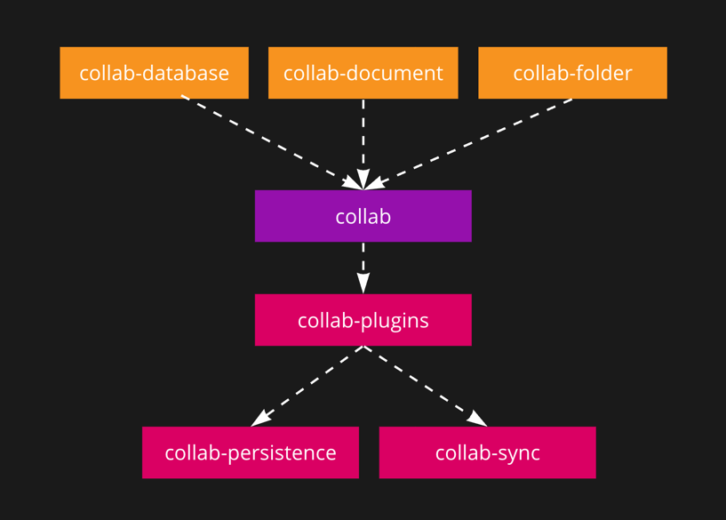

# AppFlowy-Collab

`AppFlowy-Collab` is a project that aims to support the collaborative features of AppFlowy. It consists of several crates that are currently under active development:

* `collab`
* `collab-database`
* `collab-document`
* `collab-folder`
* `collab-plugins`
* `collab-sync`

As the project is still a work in progress, it is rapidly evolving to improve its features and functionality. Therefore,
it may still have some bugs and limitations, and its API may change frequently as new features are added and existing
ones are refined.

## collab
The `collab` crate is built on top of the [yrs](https://docs.rs/yrs/latest/yrs/) crate, providing a higher level of
abstraction for the collaborative features of AppFlowy. It offers a simple API for creating and managing collaborative
documents.

## collab-database
The `collab-database` crate provides a simple API for creating and managing collaborative databases. It is built on top
of the `collab` crate.

## collab-document
The `collab-document` crate provides a simple API for creating and managing collaborative documents. It is built on top
of the `collab` crate.

## collab-folder
The `collab-folder` crate provides a simple API for creating and managing collaborative folders. It is built on top of
the `collab` crate.

## collab-plugins
The `collab-plugins` crate contains a list of plugins that can be used with the `collab` crate. 

## collab-sync
The `collab-sync` crate supports syncing the collaborative documents to a remote server.