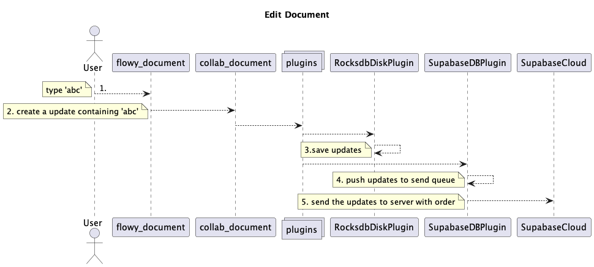
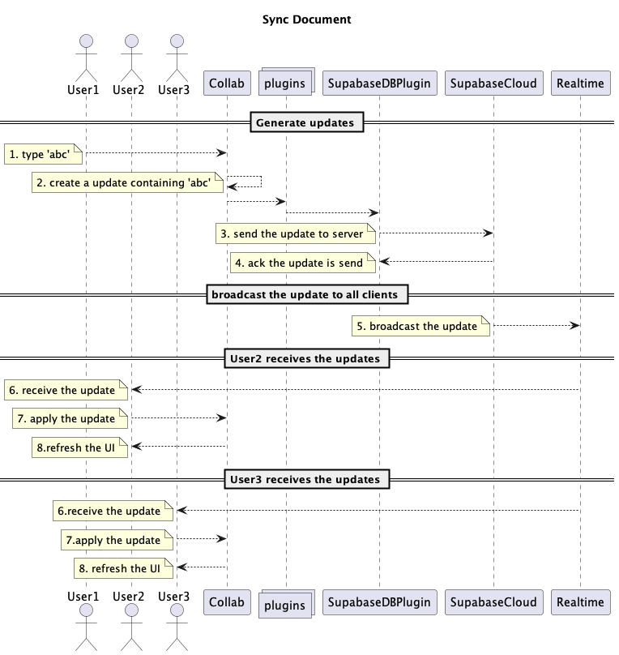

# Understanding the Architecture of AppFlowy

The presented PlantUML diagrams outline the architecture and workflow of a collaborative
document editor, referred to as the AppFlowy application. It highlights the roles of
different components and how they interact to create, open, edit, and synchronize documents.

### Architecture of AppFlowy

At its core, the AppFlowy application comprises three essential components: `flowy-folder`, `flowy-database`, and `flowy-document`. Alongside these, the `Collab` and `CollabPlugins` components play pivotal roles in data management and synchronization, connecting the core components of AppFlowy to a variety of data storage and synchronization plugins.

Designed with flexibility in mind, AppFlowy is engineered to interface seamlessly with various databases via `CollabPlugins`. At present, it supports RocksDB and Supabase. RocksDB was chosen for its high performance and availability, which makes it an excellent local storage solution.

The core components of the AppFlowy application interact with their corresponding elements within the `Collab` component. This `Collab` component then interfaces with the `CollabPlugins`. The modularity of AppFlowy's architecture allows for its functionality to be extended through the integration of new plugins into the `CollabPlugins` component.

For example, the integration of specific plugins could enable the storage of collaborative data in services like AWS or Firebase. Peer-to-peer synchronization could be made possible through the `RealtimePlugin`, while the `ContentIndexingPlugin` could be used to index the content of the collaboration, thereby supporting search functionality.

To illustrate how collaboration works within AppFlowy, let's walk through the process of creating a document. The other kind of collab object workflow is similar to this one, so we will not go through it in detail.

### Creating a Document

The creation of a new document in AppFlowy involves a series of steps, initiated by the user and facilitated by several components of the application.

1. The user initiates the process by clicking on the 'Create Document' button.
2. `flowy_folder` responds by creating a view with the specified document type.
3. Subsequently, `flowy_document` generates a document using the ID of the view.
4. These updates are then propagated to all plugins through `collab_document`.
5. `RocksdbDiskPlugin` captures these updates and saves them to the local disk.
6. Finally, `SupabaseDBPlugin` sends the updates to the server, ensuring that the document is stored and ready for collaboration.

### Opening a Document

Opening a document and keeping it in sync with the server is a multi-step process:

1. User opens the document.
2. `Collab` calls the `did_init` method of all plugins.
3. `SupabaseDBPlugin` sends an initial synchronization request to the server.
4. The server sends back an initial synchronization response, which is received by the `SupabaseDBPlugin`.

### Editing a Document

Editing a document is an interactive process that involves user action and several components of the system:

1. User types 'abc'.
2. `flowy_document` creates an update containing 'abc'.
3. Updates get saved locally via `RocksdbDiskPlugin`.
4. Updates get pushed to send queue via `SupabaseDBPlugin`.
5. The updates are sent to the server in order.

### Document Synchronization

The real-time synchronization of a document across different users involves the following steps:

1. User1 types 'abc'.
2. `Collab` creates an update containing 'abc'.
3. `SupabaseDBPlugin` sends the update to the server.
4. The server acknowledges the receipt of the update.
5. The server broadcasts the update.
6. Other users (User2, User3) receive the update.
7. Users apply the update.
8. UI is refreshed to reflect the updates.

